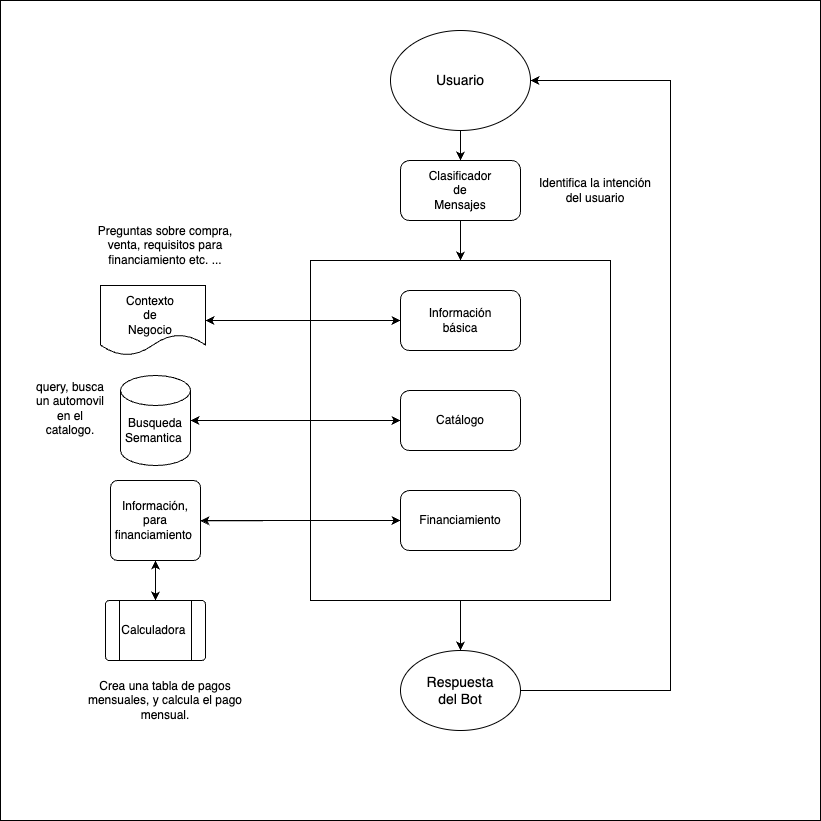

# Ejercicio Agente comercia AI

[](https://www.python.org/downloads/)
[](https://fastapi.tiangolo.com/)

## Índice

- [Descripción](#descripción)
- [Arquitectura](#arquitectura)
  - [Diagrama de Flujo](#diagrama-de-flujo)
  - [Prompts, Agentes y Componentes](#prompts-agentes-y-componentes)
- [Roadmap](#roadmap)
- [Instalación](#instalación)
- [Uso](#uso)


## Descripción

Este proyecto es una API desarrollada en Python utilizando FastAPI, para un agente comercial diseñado para manejar conversaciones de clientes en el entorno del E-commerce KAVAK especializado en en compra-venta de automóviles semi-nuevos y usados. El agente incluye un módulo para procesar mensajes de clientes y dar respuestas dadas las necesdades del usuario. 

## Arquitectura

### Diagrama de Flujo

<div style="text-align: center; background-color: white; padding: 10px; display: inline-block;">
    
</div>


El diagrama de flujo describe el proceso desde que un cliente envía un mensaje hasta que la respuesta es procesada y enviada de vuelta. Cada mensaje en clasificado en 3 intenciones "Información básica" para preguntas acerca del negocio así como pasos y requisitos para compra y venta, "Catálogo" cuando el usuario busca la disponibilidad de cierta unidad en el catálogo, "Financiamiento" ayuda a calcular pagos mensuales de un vehículo según su precio y pago inicial.

### Agentes y Componentes

- **Cliente:** Envía solicitudes a la API.
- **FastAPI:** Framework principal que maneja las solicitudes HTTP y las respuestas.
- **Bot de E-commerce:** Procesa y genera respuestas automáticas basadas en los mensajes de los clientes.
- **Base de Datos Vectorial:** Almacena el catalogo de vehículos disponibles, se accede a los datos a través de busqueda semantica.

## Roadmap

Esta sección describe el progreso planificado y las próximas etapas para llevar la API a producción.

### Fase 1: Desarrollo Inicial

- [x] Configuración del entorno de desarrollo.
- [x] Creación del esqueleto básico de la API utilizando FastAPI.
- [x] Implementación de endpoints básicos para manejar mensajes de clientes.
- [x] Integración de un sistema de logging para monitoreo.

### Fase 2: Ampliación de Funcionalidades

- [ ] Añadir soporte para autenticación y autorización.
- [ ] Implementar conexión con una base de datos para almacenar mensajes e historial de pedidos.
- [ ] Desarrollar un sistema de respuestas automáticas utilizando inteligencia artificial.
- [ ] Mejorar la documentación y pruebas unitarias.

### Fase 3: Preparación para Producción

- [ ] Configuración de CI/CD para despliegue automático.
- [ ] Optimización del rendimiento y pruebas de carga.
- [ ] Implementación de monitorización y alertas en tiempo real.
- [ ] Despliegue en un entorno de producción seguro.

### Fase 4: Post-Producción

- [ ] Feedback loop con usuarios finales para mejoras continuas.
- [ ] Integración de nuevas funcionalidades basadas en las necesidades del negocio.
- [ ] Mantenimiento y actualizaciones regulares.


## Instalación

Para instalar y configurar el proyecto localmente, sigue estos pasos:

1. Clona el repositorio:

    ```bash
    git clone https://github.com/alexrods/bot-kavak-alexrods.git
    cd bot-kavak-alexrods
    ```

2. Crea y activa un entorno virtual:

    ```bash
    python3 -m venv venv
    source venv/bin/activate  # En Windows: venv\Scripts\activate
    ```

3. Instala las dependencias:

    ```bash
    pip install -r requirements.txt
    ```

4. Configura las variables de entorno:

    Crea un archivo `.env` en la raíz del proyecto y define las variables necesarias.
    ```bash
    OPENAI_API_KEY=xxxxxxxxxx
    PINECONE_APIKEY=xxxxxxxxx
    ```
    *Nota: La api de OPENAI debe tener acceso a los modelos de embbedigs.*

5. Ejecuta la aplicación:

    ```bash
    uvicorn app.main:app --reload
    ```

6. Accede a la documentación interactiva de la API:

    Visita [http://127.0.0.1:8000/docs](http://127.0.0.1:8000/docs) para explorar la API.

## Uso

Para enviar solicitudes a la API, puedes utilizar herramientas como `curl`, `Postman`, o integrarlas directamente en tu aplicación cliente. Aquí hay un ejemplo básico de cómo enviar una solicitud POST:

```bash
curl -X POST "http://127.0.0.1:8000/api/v1/bot" -H "Content-Type: application/json" -d '{
  "mensaje": "Hola, ¿Qué es Kavak?"
}'
